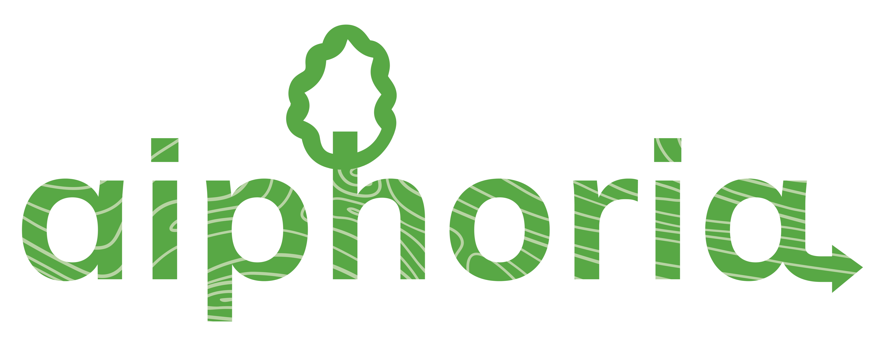

## Python package for assessing and visualizing dynamic wood material flows

> ℹ️ _This package is still under development & will become available by June._

This is a python package for dynamic wood material flows that helps you assess and visualize the wood material flows over time. `aiphoria` builds on top of [ODYM - Open Dynamic Material Systems Model](https://github.com/IndEcol/ODYM).

## Features:
`aiphoria` allows you to:
- **Visualize wood material flows** through a sankey diagram throughout the product's supply chain (raw material, transformation, use, post-use).
- **Connect semi-finished products to end uses and scenario development**  through connecting statistics (absolute values) to bibliographic and market data on the end uses of wood (shares). As well as, defining different shares (scenario development) of semi-finished wood products to value-added markets.

## Use cases:
`aiphoria` is ideal for:
- **Any temporal and spatial situation where a product flow needs to be assessed**
- **Product sink/stock effects**
- **Temporal carbon accounting**

## Support:
If you have any questions or need help, do not hesitate to contact us:
- [Janne.Jarvikyla@efi.int](mailto:Janne.Jarvikyla@efi.int)
- [cleo.orfanidou@efi.int](mailto:cleo.orfanidou@efi.int)
