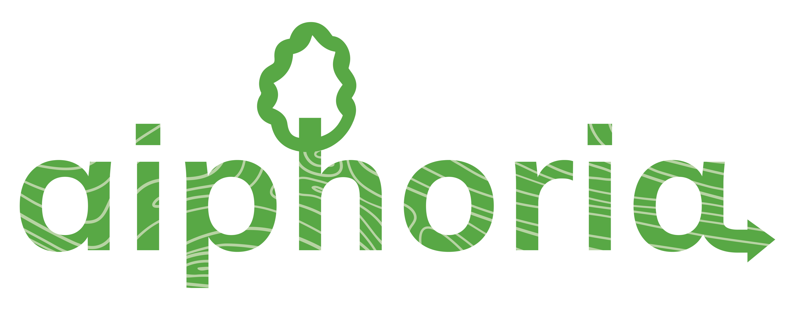

<h1>
  <picture>
    <source media="(prefers-color-scheme: dark)" srcset="docs/_static/aiphoria-logo.png" height="50">
    
  </picture>
</h1>

## Python library for assessing and visualizing dynamic wood material flows

> ℹ️ _This library is under continuous development_

This is a Python library that facilitates the assessment of wood materials flows, associated carbon stocks, and stock changes, as well as and their visualization over time. `aiphoria` builds on top of [ODYM - Open Dynamic Material Systems Model](https://github.com/IndEcol/ODYM).

## Features:
`aiphoria` allows you to:

- **Solve flows** provided both in absolute and relative (%) values, for example semi-finished wood product statistics (absolute values) to end-uses (relative values)
- **Conduct dynamic MFA and temporary carbon accounting**
- **Visualize material flows** through a Sankey diagram and provided timestep.

## Use cases:
`aiphoria` is ideal for:
- **Any temporal and spatial situation where material systems want to be assessed**
- **Product sink/stock effects**

## Support:
If you have any questions or need help, do not hesitate to contact us:
- [cleo.orfanidou@efi.int](mailto:cleo.orfanidou@efi.int)
- [janne.jarvikyla@efi.int](mailto:janne.jarvikyla@efi.int)
