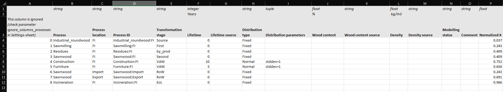
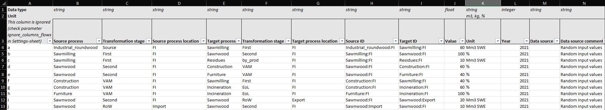
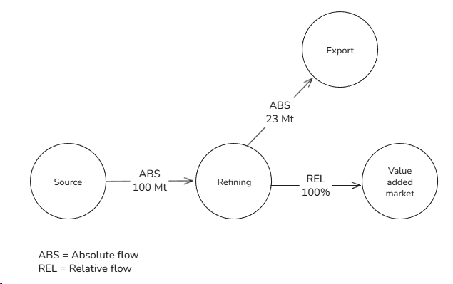
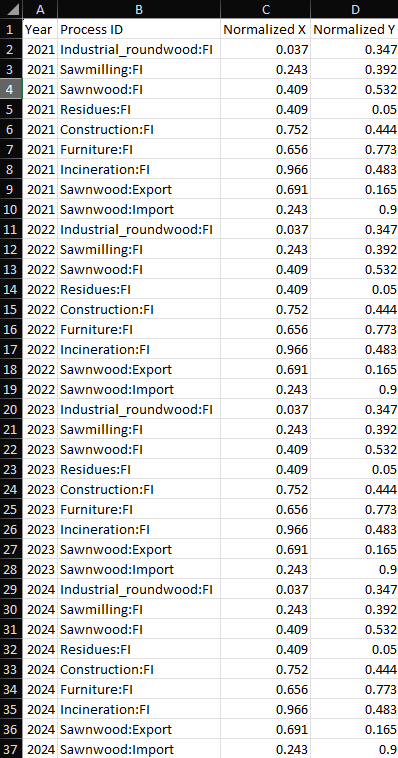
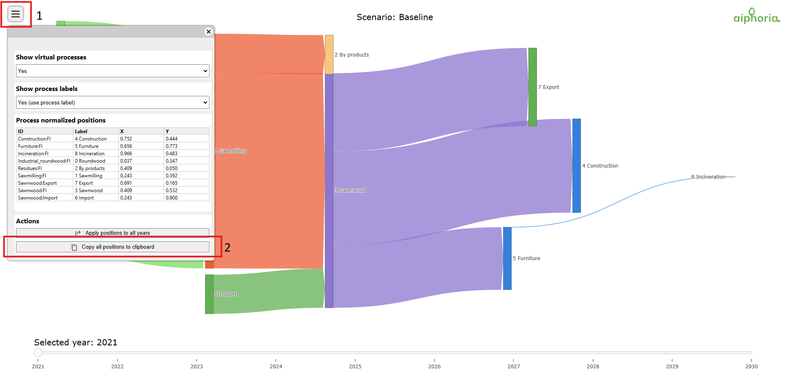
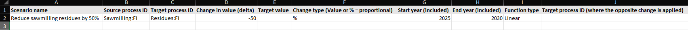
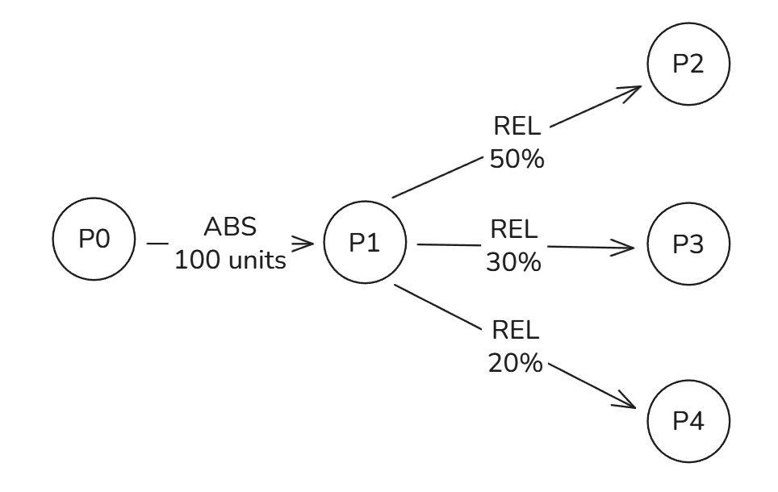

# Part 2 - Defining data for scenario

aiphoria uses Excel files for storing scenario data. Main benefits for using Excel workbook is
- Keeping file count at minimum = only one settings file 
- Allows storing all required data within one file = one sheet for one type of data
- Allows to do data validation in settings file = makes scenario configuration for user easier

Example scenario file contains multiple sheets:

| Sheet name                 | Description                                         |
|----------------------------|-----------------------------------------------------| 
| Settings                   | Contains scenario settings                          |
| Processes                  | Contains data for processes                         |
| Flows                      | Contains data for flows                             |
| Process positions          | Contains process positions for Sankey graph         |
| Scenarios                  | Contains alternative scenario definitions           |
| Colors                     | Contains color data for transformation stages       |
| Data validation parameters | Contains data for checking values inside Excel file |

> NOTE: Sheet named **Data validation parameters** is only used for value validation inside Excel  

These sheet names can be changed using parameters:

| Sheet name        | Parameter name               |
|-------------------|------------------------------|
| Processes         | sheet_name_processes         |
| Flows             | sheet_name_flows             |
| Process positions | sheet_name_process_positions |
| Scenarios         | sheet_name_scenarios         |
| Colors            | sheet_name_colors            |

---
## Processes-sheet

In this sheet you define process properties (e.g. name, transformation stage, stock type) 

Here is breakdown of columns in Process-sheet:

The most important columns in the example scenario file are as follows:
- Column A:
  - Ignored / not used
  - Can be used as comment field
> NOTE: List of columns to ignore while aiphora reads the settings file can be defined in the Settings-sheet
- Column B - Process
  - Name of the process
  
- Column C - Process location
  - Location name where process is located, used as part of process ID
  
- Column D - Process ID
  - Process ID, process unique identifier and used internally when solving flows
  - NOTE: Must be unique 
  
- Column E - Transformation stage
  - Transformation stage where process belongs
  - Process and flow colors are based on the transformation stage in interactive visualizations
  
- Column F - Lifetime
  - Process lifetime
  - Process will become stock if lifetime > 0
  
- Column G - Lifetime source
  - Comment field about lifetime, can contain arbitrary text
  
- Column H - Distribution type
  - TODO: Need help from Cleo, how to explain this
  - TODO: Stock distribution parameter (defines how stock "behaves")
  
- Column I - Distribution parameters
  - Parameters for stock distribution function
  
- Column J - Wood content
  - Comment field, can contain arbitrary text
  
- Column K - Wood content source
  - Comment field, can contain arbitrary text
  
- Column L - Density
  - Comment field, can contain arbitrary text
  
- Column M - Density source
  - Comment field, can contain arbitrary text
  
- Column N - Modelling status
  - Comment field, can contain arbitrary text
  
- Column O - Comment
  - Comment field, can contain arbitrary text
  
- Column P - Normalized X
  - Process normalized X position, can be left empty
  - This is overridden by position defined in Process position -sheet
  - TODO: Check if this is true
  
- Column Q - Normalized Y
  - Process normalized Y position, can be left empty
  - This is overridden by position defined in Process position -sheet
  - TODO: Check if this is true
  
- Column R - Label shown in graph
  - Process label shown in network graph and in Sankey chart 
  - This is overridden by position defined in Process position -sheet
  - TODO: Check if this is true
  
    
> NOTE: Processes with lifetime = 0 are processes where inflow and outflow happens during the same timestep and therefore those are not stocks. 
> Stock is just a process with defined lifetime. Depending on the selected distribution type, stock can be thought as a process with delayed outflows.
> For example with "Fixed" distribution type this is easy to see because lifetime works as a delay so that the inflows and outflowing from the process after the lifetime amount of years.

---
## Flows-sheet

In this sheet you can define data for flows used in scenario. 
Each year represents separate graphs and only flows that have the same year are part of that graph. 
aiphoria can automatically fill flows for missing years if flow data exists only part of the selected simulation year range.

> NOTE: To use automatic filling method following parameters in Settings-sheet:
> - **fill_method**
> - **fill_missing_absolute_flows**
> - **fill_missing_relative_flows**

Here is breakdown of columns in Flows-sheet:
- Column A - Ignored (see Settings-sheet and parameter **ignore_columns_flows**)
  - Comment field, can contain arbitrary text 
  
- Column B - Source process name
  - Name of the source process
  - NOTE: Must match with the name for process ID defined in Process-sheet
  
- Column C - Transformation stage (for source process)
  - Source process transformation stage
  - NOTE: Must match with the transformation stage defined for process in Processes-sheet
  - NOTE: Excel XLOOKUP-function is used to get data from Processes-sheet using value in Source ID-column  
  
- Column D - Source process location
  - Source process location
  - NOTE: Must match with the location for process ID defined in Processes-sheet 
  
- Column E - Target process name
  - Name of the target process
  - NOTE: Must match with the name for process ID defined in Process-sheet
  
- Column F - Transformation stage (for target process)
- Target process transformation stage
  - Name of the target process transformation stage
  - NOTE: Must match with the transformation stage defined for process in Processes-sheet
  - NOTE: Excel XLOOKUP-function is used to get data from Processes-sheet using value in Source ID-column  
 
 
- Column G - Target process location
  - Target process location
  - NOTE: Must match with the location for process ID defined in Processes-sheet 
  
- Column H - Source ID
  - Flow source process ID - process ID where flow is coming from
    - Process ID must match with the process ID defined in Processes-sheet
  - NOTE: Example scenario uses cell formula for creating process ID 
  
- Column I - Target ID
  - Flow target process ID - process ID where flow is going to 
    - Process ID must match with the process ID defined in Processes-sheet
  - NOTE: Example scenario uses cell formula for creating process ID 
  
- Column J - Value
  - Flow value, represents baseline value (e.g. solid wood equivalent)
  - Value must be always positive number
    - Absolute values must be >= 0
    - Relative values must be in range [0, 100]
    - TODO: Now it's possible to put negative value and everything is run without error messages. Is this correct behaviour? Should we detect negative numbers and stop execution if that happens?
  
- Column K - Unit
  - Flow value unit name
  - Relative flow is defined by using '%', otherwise flow is absolute
  - NOTE: No automatic conversion between units are done, values in rows are used as text only
  
- Column L - Year
  - Year when flow happens
  
- Column M - Data source
  - Comment field, can contain arbitrary text 
  
- Column N - Data source comment
  - Comment field, can contain arbitrary text 
  
- Column O - Indicator name (here named as **Carbon (Mt)**)
  - Indicator name is defined by column title:
    - Indicator name is the part before parenthesis e.g. **Carbon**
    - Indicator unit is defined inside parenthesis e.g. **Mt**
  - Indicator conversion factor is defined for rows after the indicator name
    - Indicator conversion factor is multiplier from baseline e.g. value of 0.2 is 20% of baseline value
    - Default indicator conversion factor of 1.0 is used if row is left empty
  - NOTE: Indicators columns must always come in pairs and in this order:
    - Indicator name
    - Indicator comment
  
- Column P - Indicator name (here names as "Comment")
  - Defines indicator comment
  - Comment field, can contain arbitrary text
  
> NOTE: You can define multiple new indicators by adding two more columns for each new indicator needed:
> - First one defines the indicator conversion factor and indicator name with unit and
> - Second one is comment field
> 
> Error message is raised if indicator does not have the two required columns

---
### Background about flows
Flows represent one-way connection between processes and each flow will have source process and target process. There are two types of flows:
* absolute flows
* relative flows

### Absolute flow
Absolute flows represent constant values: these values are known before solving the system. 

### Relative flow
Relative flows represent unknown values and shares (as fraction of available outflow) that depends on other parts of the system. 

> NOTE: Relative flow should have value between 0 and 100%. Total sum of all relative outflows for one process should be 100%.
> When relative flow has value 100% it means **everything that is available after absolute outflows**.

> **Example about relative flows**
> 
> In this simplified scenario we know the absolute flows from "**Refining**" to "**Export**" but we don't know the value from "**Refining**" to "**Value added market**". 
> When solving the scenario relative flow from "**Refining**" to "**Value added market**" is going to be 
> 
> total_in = Total inflows "Refining" = 100 Mt 
> total_out_abs = Total absolute outflows from "Refining" = 23 Mt 
> total_out_rel = total_in - total_out_abs = 100 Mt - 23 Mt = 77 Mt 
> 
> All total relative outflows from "Refining" is therefore 77 Mt. 
> The relative flow value is the share of that value = 77 Mt * 100% = 77 Mt 
> 
> 

---
## Process positions - sheet

In this sheet you can define process positions for Sankey chart for every year. 
Process X and Y position values must in normalized form (in range 0. ... 1.0). 
Using normalized position values allows process positioning in Sankey graph to be resolution-independent. 

> NOTE: 
> You can use copy positions for all years easily from Sankey chart visualization by:
> 1) Open menu on top left corner (1) 
> 2) Clicking the button "Copy all position to clipboard" 
> 3) Select cell A1 in "Process positions" sheet and paste the results
> 
> 

---
## Scenarios-sheet

In this sheet you can define alternative scenarios by introducing flow variations to the baseline scenario and that way create new scenarios during run-time. 

> NOTE: Alternative scenario means a baseline scenario that has been
> changed in some way, for example source flows are reduced by 50%.
> This feature is useful if want to analyse how system reacts when
> changes are introduced (e.g. how stock accumulation changes).

Here is breakdown of columns in Scenarios-sheet:
- Column A - Scenario name
  - dsf
- Column B - Source process ID
  - asdf
- Column C - Target process ID
  - sdf
- Column D - Change in value (delta)
  - sdf
- Column E - Target value
  - sdf
- Column F - Change type (Value or % = proportional)
  - dsf
- Column G - Start year (included)
  - adsf
- Column H - End year (included)
  - dsaf
- Column I - Function type
  - sdfa
- Column J - Target process ID (where the opposite change is applied)
  - There could be multiple of these columns defined: these columns contains process ID where the opposite effect is applied,
  otherwise introducing changes to system would cause mass imbalance to system and that would appear is missing or unreported flows.
  - Target process ID must be connected to source process ID,

### Background

Alternative scenarios are introduced by giving name for the flow modification in Scenarios-sheet: all rows using the same scenario name belong to the same scenario. 
Flow data as it is in Excel file represents the baseline scenario and alternative scenarios are dynamically created in run-time by applying flow modifications on top of baseline scenario. 

For example:

| Scenario   | Source process ID | Target process ID | Change in value (delta) | Target value | Change type | ...  |
|------------|-------------------|-------------------|-------------------------|--------------|-------------|------|
| Scenario 1 | P1                | P2                | 50                      |              | %           | ...  |
| Scenario 1 | P1                | P2                | 50                      |              | %           | ...  |
| Scenario 2 | P0                | P1                | 25                      |              | %           | ...  |

This configuration will create alternative scenarios so total of 3 scenarios are created during run-time:
- Baseline
- Scenario 1
- Scenario 2

> NOTE: Baseline scenario is always created with the name "Baseline" to output directory 

Processing order during run-time is as follows:
1) Solve baseline scenario
2) For every new scenario defined in Scenarios-sheet
   - Copy baseline scenario data as base for new alternative scenario
   - Apply all flow modifications for this new alternative scenario from Scenarios-sheet 
   - Solve new alternative scenario
  

### Scenario example

aiphoria iteratively solves these flow graphs until either every flow value has been computed or until encounters endless loop of dependencies. 

