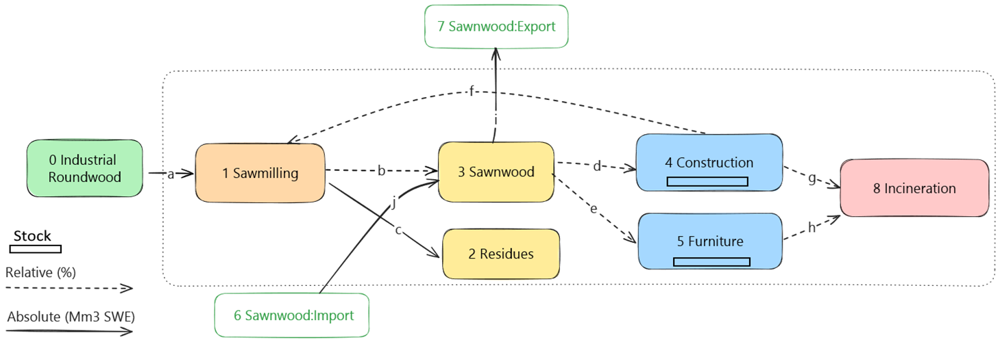
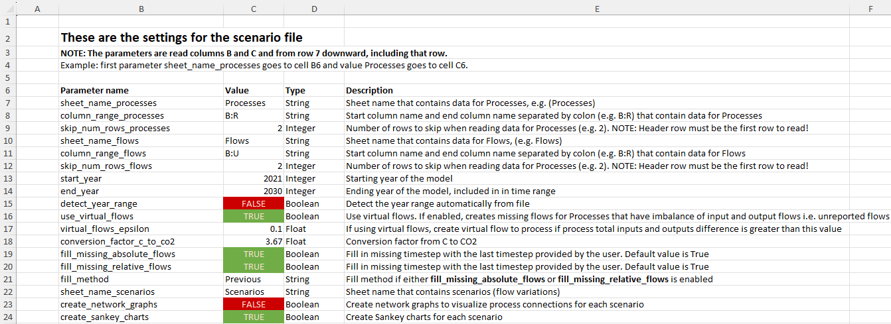
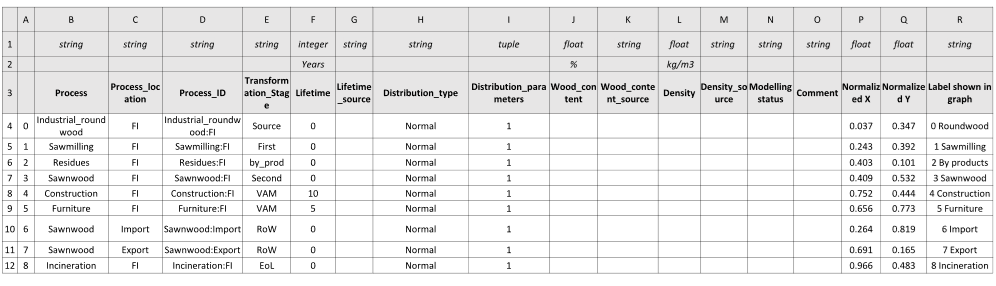
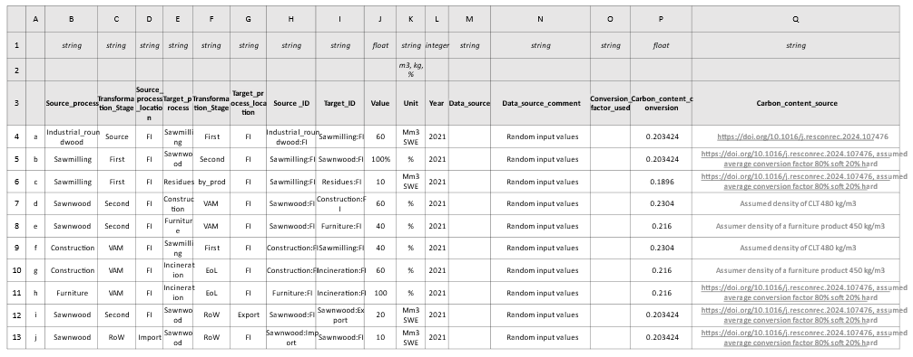

Step 1 - User input

To get started with aiphoria we will develop a very simple MFA system. 
The system contains nine processes (nodes) including the source process and ten flows.
There are two stocks (construction and furniture) which are processes with a given lifetime. 
You can see that some flows are defined with absolute values and some with relative ones.

> NOTE:<br>
> Flow from source process to the system must always be absolute, otherwise calculating the actual values for flows is impossible.<br>
> aiphoria will check data for errors and will show error messages if something is not correct.

The system looks like this:


Below are the model characteristics for the simplified MFA system. 

|                                  | Model characteristics                                | 
|----------------------------------|------------------------------------------------------|
| MFA type                         | inflow driven                                        | 
| Stock lifetimes                  | construction (lt: 10 years), furniture (lt: 5 years) |
| Start year (first year of flows) | 2010                                                 | 
| End year (last year of flows)    | 2030                                                 |
| Distribution type for stocks     | Normal                                               |
| Standard deviation (of lifetime) | 1                                                    |

-----


Below are the screenshots of how the above shown system is defined in the input file. 

Settings: 


Processes:


Flows:



As a first step remember to configure the path for ODYM and install the required packages 

```python
import sys, os
import numpy as np
import pandas as pd
import shutil
import matplotlib.pyplot as plt
from core.dataprovider import DataProvider
from core.datachecker import DataChecker
from core.datavisualizer import DataVisualizer
from core.network_graph import NetworkGraph
from core.flowsolver import FlowSolver
from core.parameters import ParameterName

# Path configuration
sys.path.insert(0, os.path.join('.'))
sys.path.insert(0, os.path.join(os.getcwd(), '.', 'lib', 'odym', 'modules'))

# ODYM classes
import ODYM_Classes as msc

```

Now it is time to load load the data from Excel file DataProvider 
```python
#Data and model parameters should be loaded from the input file using the 'DataProvider'

filename = "data/example_data.xlsx"

print("Loading data from file {}...".format(filename))
dataprovider = DataProvider(filename)

#Model parameters is a Dictionary that contains loaded data from Excel sheet named "Settings"
#and are used for running the FlowSolver and setting up ODYM

model_params = dataprovider.get_model_params()
print("Using following parameters for running the model:")
for param_name, param_value in model_params.items():
    print("\t{:32}= {}".format(param_name, param_value))

#Setup output path

rel_path_to_output = model_params[ParameterName.OutputPath]
abs_output_path = os.path.abspath(os.path.join(os.getcwd(), rel_path_to_output))
model_params[ParameterName.OutputPath] = abs_output_path
```
