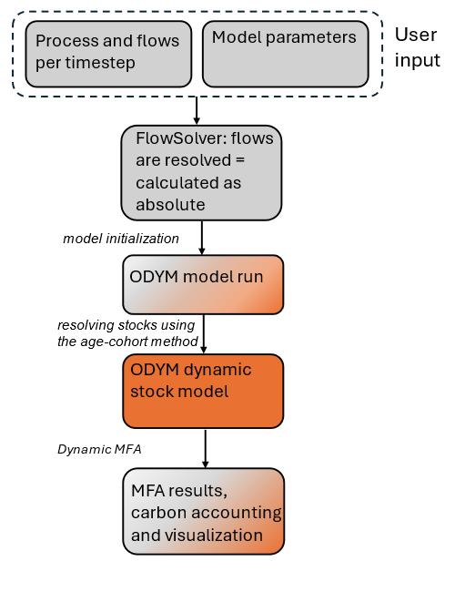

# Getting Started

This section aims on giving a high level introduction on how to start with `aiphoria`. 

Grey color indicates `aiphoria` core code, while orange the parts that ODYM is utilized. In the following sections, we’ll walk through the different steps, considering a very simple dummy system.

---
hidden:
maxdepth: 1
---
Step 1 - User input>
Step 2 - Flowsolver>
Step 3 - ODYM model run>
Step 4 - ODYM dnyamic stock model <dMFA>